# FCND-Estimation-CPP
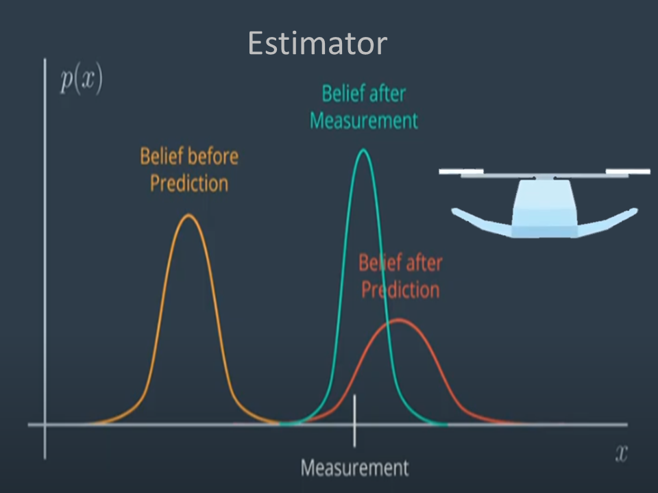  
This project is part of [Udacity](https://www.udacity.com "Udacity - Be in demand")'s [Flying Car Nanodegree](https://www.udacity.com/course/flying-car-nanodegree--nd787).  The project is to build the estimation portion for Drone Controller with C++ in a simulator. The project is using Visual Studio 2022.

---

# Project Description
The assignment of this project is mainly to develop key software functions for Drone Estimator and then work with the PID Controller that we did on the last project to form a Drone Controller. On this project, the technique of Sensor Fusion has been implement through Extended Kalman Filter and Complimentary Filter.  To ensure the project move smooth,  the project is developed step by step. And there are 6 steps:
<ul>
        <li>Sensors Noise</li>
        <li>Attitude Estimation</li>
        <li>Prediction Step</li>
        <li>Magnetometer Update</li>
        <li>Closed Loop + GPS Update</li>
        <li>Adding the PID Controller</li>        
</ul>        

# Project Setup
<ul>
<li>Download or clone the C++ simulator repository</li>  

    git clone https://github.com/udacity/FCND-Estimation-CPP.git

<li>Download and install Visual Studio.</li>
<li>Select Open Project/Solution and open <simulator>/Simulator.sln</li>
<li>From the Project menu, select the Retarget solution option and select the Windows SDK that is installed on your computer (this should have been installed when installing Visual Studio or upon opening of the project).</li>
<li>To compile and run the project/simulator, simply click on the green play button at the top of the screen.  When you run the simulator, you should see a single quadcopter, falling down.</li>
</ul>

# Implementation 
All the C++ codes are in the [./src](./src) directory. However, most of my work only focus on the below four files:  <ul>
        <li> [QuadEstimatorEKF.cpp](./src/QuadEstimatorEKF.cpp): it contains the software modules that need to build the Estimator.</li>
        <li> [QuadEstimatorEKF.txt](./config/QuadEstimatorEKF.txt): it contains the software modules that need to build the Estimator.</li>
        <li> [QuadControl.cpp](./src/QuadControl.cpp): it contains the software modules that need to build the cascaded 3D controller.</li>
        <li> [QuadControlParams.txt](./config/QuadControlParams.txt): the file contains the configuration data for the cascaded 3D controller.</li>
</ul>      
                
## Step 1: Sensor Noise
None of the sensors has no noise.  So we need to know how noisy of a sensor.  On this assignment,  the quad's sensor has been simulated to add with some noise. What we need to do is to record some sensor data on a static quad.  And then,  based on the normal distribution,  we can calculated the standard deviation of a sensor data there.    
The assignment is dedicated to collect the data of GPS X data and accelerometer X data into the [Graph1.txt](./config/log/Graph1.txt) and [Graph1.txt](./config/log/Graph1.txt) respectively.  Through the standard deviation equation:

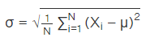  

we get the standard deviation 0.68119 and 0.493118 and set on the MeasuredStdDev_GPSPosXY and MeasuredStdDev_AccelXY respectively. The result also match the settings in
[SimulatedSensors.txt](./config/SimulatedSensors.txt)

The right standard deviative should contain 68% or more data.  The following is the test result:

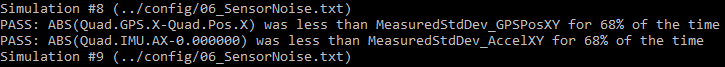  

## Step 2: Attitude Control
This step is to build a complimentary filter with the input of Accelerometer and Gyroscope to estimate the attitude of a drone. The state and measurements are given:  
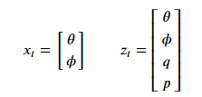  

To build a complimentary filter,  the following equation is using: 

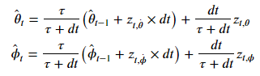  
where the theta_hat and psi_hat is the state of X, tau is the time constant and dt is time period measurement  

The first part of this equation needs rolling angle and pitch angle from the Gyro.  And the second part of this equation needs the rolling angles and pitch angle from Accelerometer.  We thus need to convert the acceleration data into the Euler angles by the following equation: 

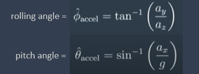

And also we need to convert the input of gyroscope from the body rate(p,q,r) to Euler angles through the following equations:

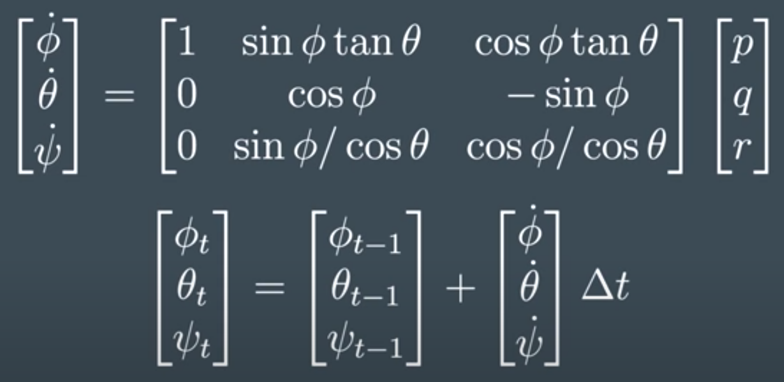

 

The code has been implement on the routine QuadEstimatorEKF::UpdateFromIMU() under the file  [QuadEstimatorEKF.cpp](./src/QuadEstimatorEKF.cpp) 

A success Attitude Controller should be able to reduce the attitdue errors to get within 0.1 rad for each of the Euler angles. The following is the test result:

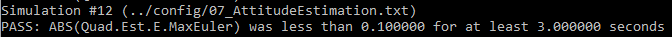

## Step 3: Predict State
This step is to show how to get the predict state and covariance after transit 1 step (i.e. after 1 dt). Since transit forward may involve the sine function of the tilt angles, Extended Kalman Filter thus is used.  So we need to show how to build up the Jocobian Matrix also.
 
The following is the procedure on how to transit the drone a step in 1D:  

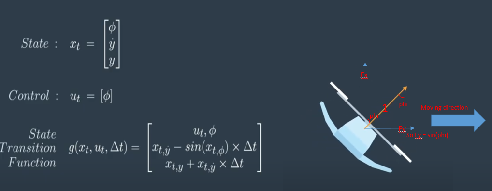

 

The following is the procedure on how to build a Jocobian Matrix in 1D

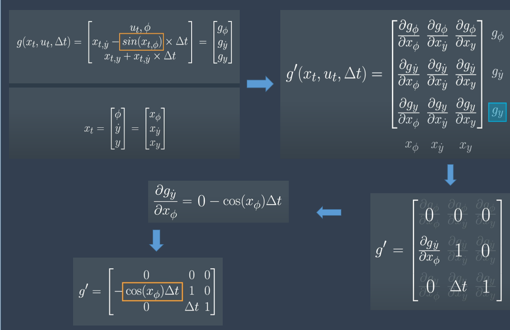

 

Similarly, we can use the algorithm to 3D with difference state and transition model as follows:  

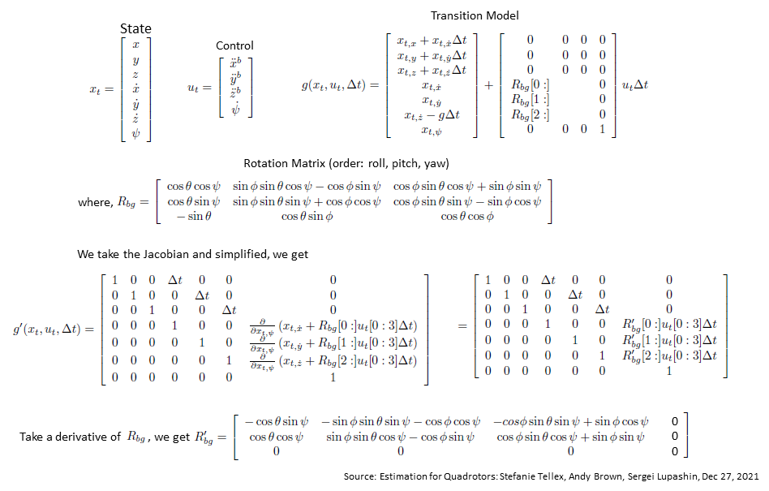

 

I have implemented the code on the routine PredictState(), GetRbgPrime() and Predict() under the file  [QuadEstimatorEKF.cpp](./src/QuadEstimatorEKF.cpp) 

There are two tests on this step.  One is for Predict State test and the other is Predict Covariance test.  
If we do it right on the Predict State, the estimator state would track the actual state, with only reasonable slow drift.  The following is the result of Predict State test:  

 

If we do it right on Predict Covariance and also we tune the QPosXYstd and QVelXYStd correctly in [QuadEstimatorEKF.txt](./config/QuadEstimatorEKF.txt),  the covariance should grows very much like the data.  The following is the test result for the Predict Covariance test:  

 

## Step 4: Magnetometer Update
If we only use the Accelerometer and Gyroscope for our estimation without the magnetometer update, we will notice that the estimate yaw is drifting away.  This step is try to make an update for the yaw value.  The algorithm for update the yaw is simple.  It is simply collect data from the Magneometer and then make a normalization to ensure the yaw angle within the boundary (-pI..PI).  And then we make an update yaw angle as follows:

        new yaw state = old yaw state + Kalman gain * (measurement - predict measurement)

The following is the formula in matrix form to get the Kalman gain:

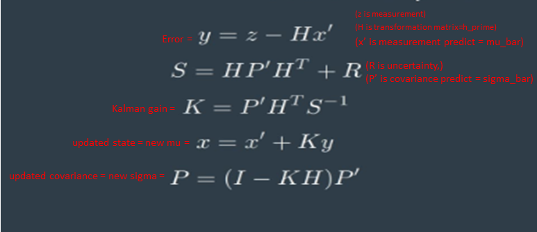

The code of Magnetometer Update has been implemented on the function UpdateFromMag() under the file  [QuadEstimatorEKF.cpp](./src/QuadEstimatorEKF.cpp).
If we do it right and the parameter QWawStd in [QuadEstimatorEKF.txt](./config/QuadEstimatorEKF.txt) is well tune, we will find that the error will be less than 0.1 radian in heading fo at least 10 seconds of the simulation.  The following is the test result: 

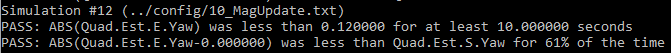

## Step 5: Closed Loop + GPS Update
If we just update the position and velocity with IMU and without GPS,  the drone will only drift away.  

The following is the procedure to update the GPS:  

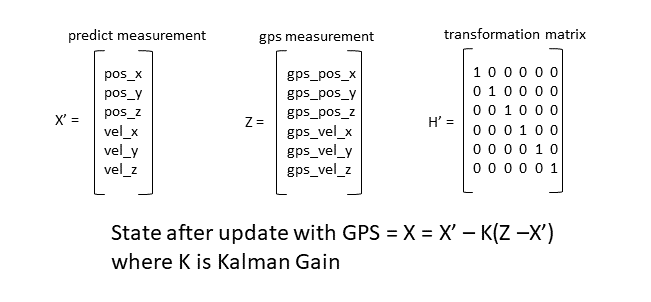

The code of GPS Update has been implemented on the function UpdateFromGPS() under the file  [QuadEstimatorEKF.cpp](./src/QuadEstimatorEKF.cpp).  
If we do it right and the parameter GPSPosXYStd, GPSPosZStd, GPSVelXYStd and GPSVelZStd in [QuadEstimatorEKF.txt](./config/QuadEstimatorEKF.txt) are well tune, we will find that the position error will be less than 1m.  The following is the test result: 

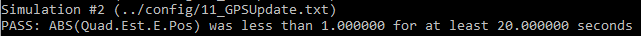

## Step 6: Adding My PID Controller
This step test whether the Estimator work on my PID Controller that I buiit on the last project.  Replaced with my QuadController.cpp and QuadControlParams.txt, and detune the position and velocity gains a little bit,  I find the estimator works great.  The following is the test result:  

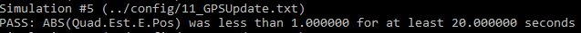

## Conclusion
It is a good course and make me learn a lot about the estimation through the skill of the Kalman Filter and Complimentary Filter.  In this project, I rely on using the Euler Angles for the rotation calculation with the help of Rotation Matrix.  However, rotation in Euler Angles has its limitation, so in the future, when I have time, I would like to use Quatarion to calculate the rotation. And also I have interest to replace the Extended Kalman Filter with the Unscented Kalman Filter which is highly recommended to try during the class.

